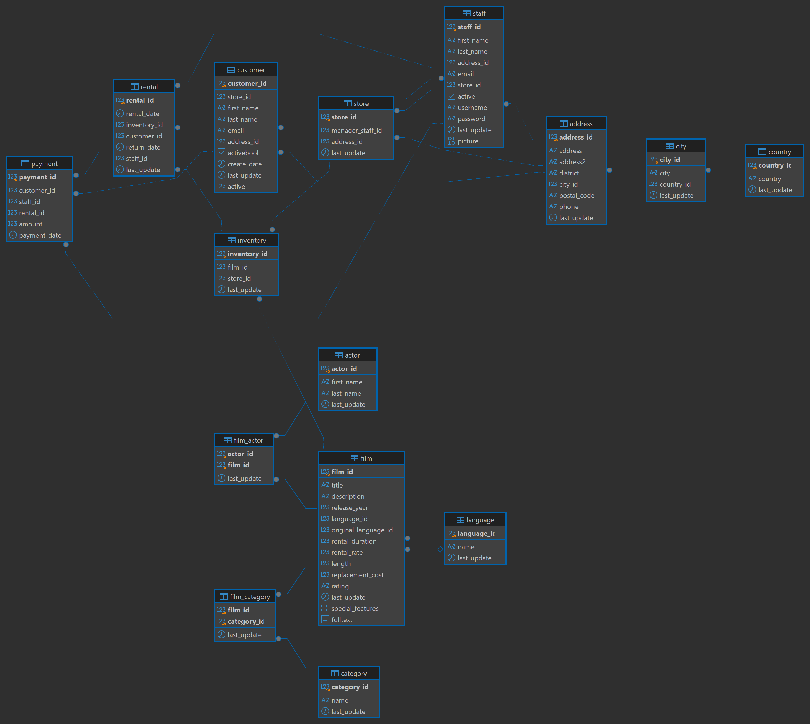

# Data Project SQL – Shakila Database

## Descripción del proyecto

Este proyecto tiene como objetivo aplicar de forma práctica los conocimientos adquiridos en el módulo de SQL mediante el análisis de la base de datos **Shakila**, utilizando **PostgreSQL** y **DBeaver**.

La base de datos representa el funcionamiento de un negocio de alquiler de películas y contiene información relacionada con películas, actores, categorías, clientes, alquileres, pagos, inventario, tiendas y empleados.

A lo largo del proyecto se han resuelto diferentes consultas SQL, desde operaciones básicas sobre una única tabla hasta consultas más complejas utilizando relaciones entre tablas, funciones de agregación, subconsultas, vistas y tablas temporales.

---

## Objetivos

Los principales objetivos del proyecto son:

- Familiarizarse con el entorno de trabajo de DBeaver.
- Comprender la estructura y las relaciones de una base de datos relacional.
- Realizar consultas sobre una y varias tablas.
- Filtrar, ordenar y agrupar información.
- Utilizar funciones de agregación.
- Trabajar con diferentes tipos de JOIN.
- Crear y utilizar subconsultas.
- Trabajar con datos temporales.
- Crear vistas.
- Aplicar buenas prácticas en la escritura y organización de consultas SQL.

---

## Herramientas utilizadas

- **PostgreSQL**
- **DBeaver**
- **SQL**
- **GitHub**

---

## Estructura de la base de datos

La base de datos utilizada está formada por diferentes tablas relacionadas entre sí.

Entre las principales se encuentran:

- `film`: información sobre las películas.
- `actor`: información sobre los actores.
- `film_actor`: relación entre películas y actores.
- `category`: categorías de las películas.
- `film_category`: relación entre películas y categorías.
- `inventory`: copias disponibles de cada película.
- `rental`: información sobre los alquileres.
- `payment`: pagos realizados.
- `customer`: información de los clientes.
- `staff`: empleados.
- `store`: tiendas.
- `address`, `city` y `country`: información geográfica.
- `language`: idiomas de las películas.

### Esquema de la BBDD


---

## Desarrollo del proyecto

El proyecto está compuesto por **64 ejercicios**.

El primer ejercicio consiste en analizar y representar el esquema de la base de datos. Los ejercicios posteriores permiten trabajar progresivamente diferentes conceptos de SQL.

### Consultas básicas

En los primeros ejercicios se realizan consultas sobre tablas individuales utilizando instrucciones como:

- `SELECT`
- `FROM`
- `WHERE`
- `DISTINCT`
- `ORDER BY`
- `LIMIT`
- `OFFSET`
- `BETWEEN`
- `IN`
- `NOT IN`
- `LIKE`
- `ILIKE`

Estas consultas permiten seleccionar columnas, aplicar filtros y ordenar los resultados obtenidos.

### Funciones de agregación

Durante el proyecto se utilizan diferentes funciones para resumir y analizar los datos:

- `COUNT()`
- `AVG()`
- `MIN()`
- `MAX()`

Estas funciones se combinan con:

- `GROUP BY`
- `HAVING`

Esto permite realizar análisis agrupados, como calcular el número de películas por clasificación, categoría o actor.

### Relaciones entre tablas

Una parte importante del proyecto consiste en trabajar con las relaciones existentes entre las diferentes tablas de la base de datos.

Para ello se utilizan diferentes tipos de JOIN:

- `INNER JOIN`
- `LEFT JOIN`
- `CROSS JOIN`

Gracias a estas relaciones es posible combinar información procedente de películas, actores, categorías, clientes, inventario, alquileres y pagos.

### Subconsultas

También se utilizan subconsultas para resolver ejercicios donde el resultado de una consulta es necesario para realizar otra operación.

Esto permite resolver problemas como:

- Buscar actores relacionados con determinadas películas.
- Identificar películas pertenecientes a determinadas categorías.
- Comparar valores con promedios calculados previamente.
- Obtener clientes que cumplen determinadas condiciones.

### Vistas

Durante el proyecto se crea la vista:

`actor_num_peliculas`

Esta vista permite almacenar una consulta que relaciona los actores con el número de películas en las que han participado.

El uso de vistas permite reutilizar consultas complejas y simplificar futuros análisis.

### Tablas temporales

También se crean tablas temporales para almacenar resultados intermedios:

- `cliente_rentas_temporal`
- `peliculas_alquiladas`

Estas tablas permiten trabajar temporalmente con resultados derivados de otras consultas sin modificar las tablas originales de la base de datos.

---

## Buenas prácticas aplicadas

Durante el desarrollo del proyecto se han aplicado diferentes buenas prácticas:

- Identificación de cada ejercicio mediante comentarios.
- Uso de nombres descriptivos para los alias.
- Formateo e indentación de las consultas.
- Uso de JOIN explícitos para representar las relaciones entre tablas.
- Agrupación correcta de los datos antes de aplicar funciones de agregación.
- Uso de `DROP TABLE IF EXISTS` en tablas temporales para permitir la ejecución repetida del script.
- Uso de `CREATE OR REPLACE VIEW` para facilitar la actualización de vistas.

---

## Estructura del repositorio

El repositorio contiene los siguientes archivos:

```text
DataProject_SQL_Shakila/
│
├── README.md
├── DataProject_SQL_Shakila.sql
└── BBDD_Schema_Shakila.png
```

- **README.md:** documentación y explicación del proyecto.
- **DataProject_SQL_Shakila.sql:** archivo con la resolución de las consultas SQL.
- **BBDD_Schema_Shakila.png:** esquema visual de la base de datos y sus relaciones.

---

## Conclusiones

Este proyecto ha permitido aplicar de forma práctica los principales conceptos de SQL sobre una base de datos relacional.

A lo largo de los ejercicios se ha trabajado desde consultas básicas sobre una única tabla hasta consultas más complejas que requieren relaciones entre varias tablas, funciones de agregación, subconsultas, vistas y tablas temporales.

Además, el análisis de la estructura de la base de datos ha permitido comprender la importancia de las relaciones entre las diferentes entidades y cómo utilizar dichas relaciones para obtener información relevante mediante SQL.
